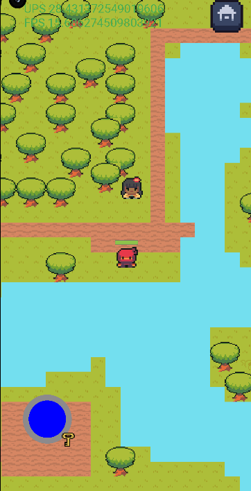
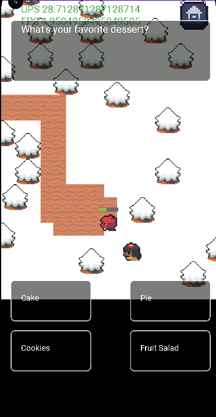
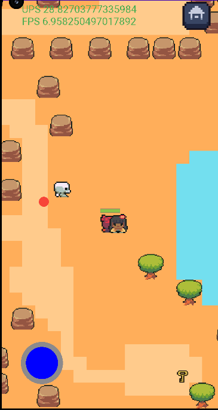

# Android 2D Game: [Soul Ninja]

## Description

[Soul Ninja] is a 2D Android game written in Java, developed in Android Studio. It features a main character controlled by a joystick, an HP (Health Points) bar, enemy interactions, NPC (Non-Playable Character) interactions, collectible keys, and tile-based maps. The game is designed with a custom game loop using SurfaceView for smooth gameplay.

## Features

- **Main Character**: Control a character positioned at the center of the screen using an on-screen joystick.

- **HP Bar**: Keep an eye on your character's health with an HP bar, which is reduced upon enemy contact.

- **Attack Mechanism**: Shoot red balls to eliminate enemies. Colliding with enemies results in a 20% HP loss.

- **NPC Interaction**: Engage in dialogues and interactions with an NPC character following your character.

- **Collectibles**: Find keys to unlock doors and progress through levels.

- **Tile Map**: Utilizes tile-based maps for level design, with impassable tiles such as water and trees.

## Gameplay

- Use the joystick to move your character around the game world.

- Collect keys to unlock doors and advance to the next levels.

- Eliminate enemies by shooting red balls.

- Be careful not to collide with enemies, as it results in a loss of 20% of your HP.

- Interact with the NPC girl for dialogues and interactions.

